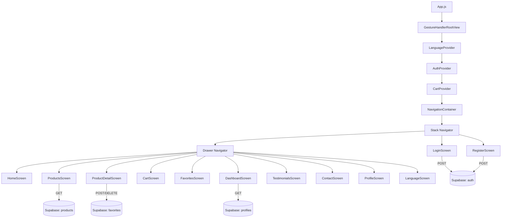

# Aurora Joias

A luxury jewelry mobile application built with React Native and Expo, compatible with Expo Snack Web and integrated with Supabase as backend. The app covers the full shopping experience — authentication, product catalog, cart management, favorites, and a multilingual interface.

Academic project — 2nd Semester | Mobile Development.

---

## Features

- **Authentication:** User registration and login via Supabase Auth, with session managed through React Context.
- **Product Catalog:** Full product listing with category filtering using `RNPicker` and `FlatList`.
- **Shopping Cart:** Add, update quantity, and remove items, with real-time total calculation.
- **Favorites:** Toggle product favorites with Supabase POST and DELETE operations.
- **Dashboard:** Admin-style panel displaying total registered users and product count per category.
- **Multilingual Interface:** Full translation support for Portuguese, English, and Spanish via a custom Language Context.
- **12 Screens:** Four mandatory academic screens plus eight custom screens aligned with the jewelry store context.

---

## Tech Stack

| Layer | Technology | Version |
|---|---|---|
| Runtime | Expo | SDK 51 |
| Framework | React Native | 0.74 |
| Navigation | React Navigation (Stack + Drawer) | 6 |
| Forms | Formik + Yup | 2 + 1 |
| Backend | Supabase REST API + Auth API | — |
| State Management | React Context API | — |
| Language | JavaScript (ES6+) | — |

> Supabase is consumed via native `fetch` (no SDK), following the REST and Auth API endpoints directly. This keeps the project compatible with Expo Snack Web without additional native dependencies.

---

## Architecture



---

## Screens

| # | Screen | Category | Key Feature |
|---|---|---|---|
| 1 | Login | Required | Formik validation + Supabase Auth |
| 2 | Register | Required | 5 validated fields (name, email, phone, password) |
| 3 | Dashboard | Required | User count + product count per category |
| 4 | Language | Required | PT / EN / ES selector via React Context |
| 5 | Home | Custom | Hero banner, category quick-nav, store stats |
| 6 | Products | Custom | FlatList + RNPicker category filter |
| 7 | Product Detail | Custom | Supabase POST/DELETE for favorites toggle |
| 8 | Cart | Custom | Quantity controls + total calculation + checkout |
| 9 | Favorites | Custom | User wishlist fetched from Supabase |
| 10 | Testimonials | Custom | Customer reviews loaded from Supabase |
| 11 | Contact | Custom | Store address, phone and business hours |
| 12 | Profile | Custom | Edit user data with Supabase PATCH |

---

## Project Structure

```
aurora-jewel-app/
├── App.js                        # Entry point — providers and NavigationContainer
├── app.json                      # Expo configuration
├── babel.config.js               # Babel with Reanimated plugin
├── package.json
│
├── navigation/
│   ├── AppNavigator.js           # Stack wrapping Drawer
│   └── DrawerContent.js         # Custom drawer with logo, menu and cart badge
│
├── screens/                      # 12 screens, each with index.js + styles.js
│   ├── LoginScreen/
│   ├── RegisterScreen/
│   ├── HomeScreen/
│   ├── ProductsScreen/
│   ├── ProductDetailScreen/
│   ├── CartScreen/
│   ├── FavoritesScreen/
│   ├── DashboardScreen/
│   ├── TestimonialsScreen/
│   ├── ContactScreen/
│   ├── ProfileScreen/
│   └── LanguageScreen/
│
├── components/                   # Reusable components, each with index.js + styles.js
│   ├── ProductCard/
│   ├── CartItem/
│   ├── TestimonialCard/
│   └── CategoryBadge/
│
├── contexts/
│   ├── AuthContext.js            # Login, register, logout
│   ├── CartContext.js            # Cart state and operations
│   └── LanguageContext.js        # Active language and t() helper
│
├── lib/
│   ├── supabase.js               # SUPABASE_URL, SUPABASE_API_KEY and fetch helpers
│   ├── i18n.js                   # Translation dictionaries (PT / EN / ES)
│   └── colors.js                 # Design token constants
│
├── assets/                       # Product images, logo, avatars (.png)
└── supabase_schema.sql           # SQL schema, RLS policies and seed data
```

---

## Color Palette

| Token | Hex | Usage |
|---|---|---|
| `primary` | `#B8860B` | Buttons, active states, borders |
| `secondary` | `#DAA520` | Headings, prices, highlights |
| `background` | `#0A0A0A` | App background |
| `surface` | `#1C1C1C` | Cards, header, drawer |
| `text` | `#F5F5DC` | Primary text |
| `textMuted` | `#A0A0A0` | Labels, placeholders |
| `error` | `#FF6B6B` | Validation errors |

---

## Getting Started

### Option 1 — Expo Snack (no installation required)

1. Open [snack.expo.dev](https://snack.expo.dev) and create a new Snack.
2. Upload all project files preserving the directory structure.
3. Edit `lib/supabase.js` with your credentials (see Supabase Setup below).
4. Select **Web** platform and click **Run**.

### Option 2 — Local development

```bash
git clone https://github.com/Isllanrx/aurora-jewel-app.git
cd aurora-jewel-app
npm install
npx expo start
```

Press `w` for web, `a` for Android emulator, or scan the QR code with Expo Go.

---

## Supabase Setup

1. Create a project at [supabase.com](https://supabase.com).
2. Navigate to **SQL Editor**, paste the contents of `supabase_schema.sql`, and run it.  
   This creates all tables, RLS policies, and inserts the initial product and testimonial seed data.
3. Go to **Project Settings > API** and copy the **Project URL** and **anon public** key.
4. Set the credentials in `lib/supabase.js`:

```js
export const SUPABASE_URL = 'https://your-project.supabase.co';
export const SUPABASE_API_KEY = 'your-anon-key';
```

> The `.env` file is ignored by Git. Credentials must be set directly in `lib/supabase.js` when running on Expo Snack, as environment variable injection is not supported on that platform.

---

## Database Schema

| Table | Description |
|---|---|
| `products` | Product catalog (name, price, category, badge, description) |
| `favorites` | User-product associations for the wishlist |
| `testimonials` | Customer reviews displayed on the Testimonials screen |
| `profiles` | Extended user data (name, phone), auto-created on signup via trigger |

Row Level Security (RLS) is enabled on all tables. Public read access is granted for `products` and `testimonials`. All other operations require an authenticated user token.

---

## Team

- Isllan Toso Pereira
- (team member 2)
- (team member 3)

---

*Aurora Joias — Academic Project, 2026*
