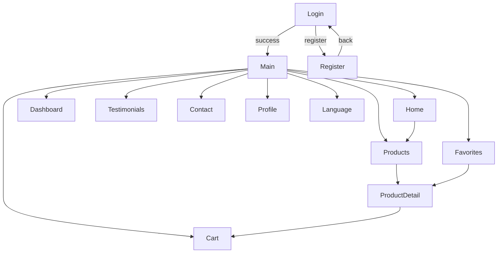
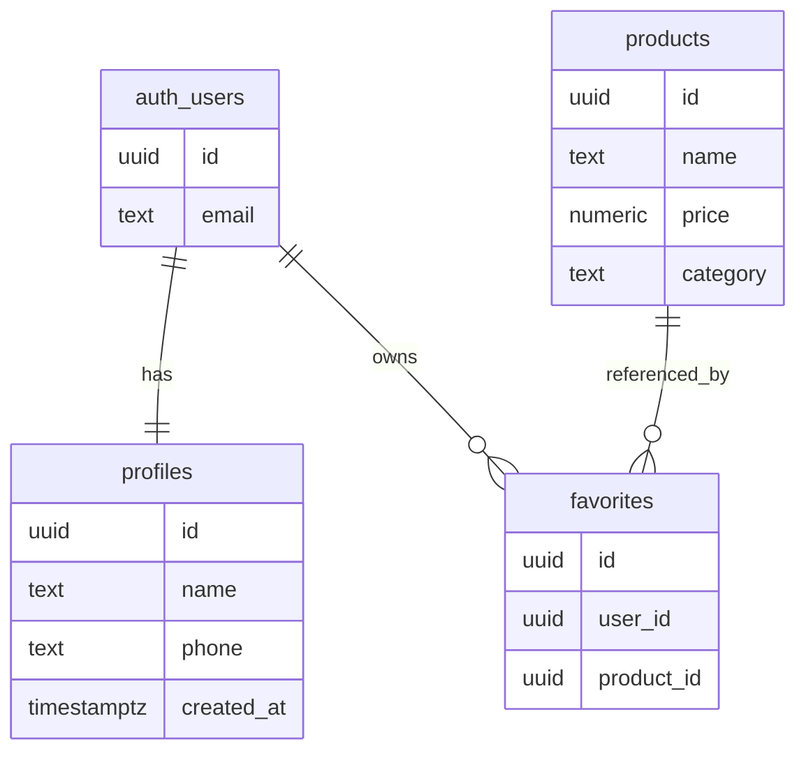
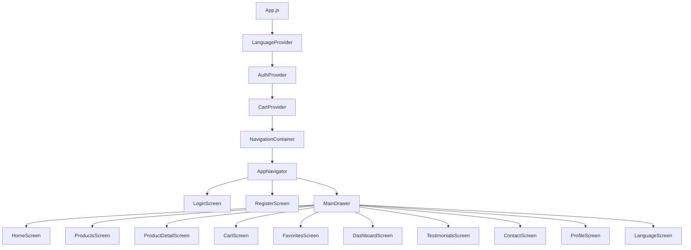

# Aurora Jewelry App

Mobile application for a luxury jewelry store built with **Expo SDK 54 + React Native 0.76**, integrated with Supabase and supporting PT / EN / ES.

**Academic Project — 2nd Term | Mobile Development**

---

## Prototype (Figma)

[View Interactive Prototype](https://www.figma.com/proto/Dh9aJJGeaxW6eiMz2ZkrUb/Projeto-devmobile?node-id=2-2&p=f&t=pMyFTEbD8noVidC6-1&scaling=min-zoom&content-scaling=fixed&page-id=0%3A1&starting-point-node-id=2%3A2)

## Tech Stack

| Layer                | Technology                                                      |
| -------------------- | --------------------------------------------------------------- |
| Runtime              | Expo SDK 54 + React Native 0.76.7                               |
| Navigation           | React Navigation 7 — Stack + Custom Drawer                      |
| Forms                | React Hook Form 7 (`useForm` + `Controller`)                    |
| Backend              | Supabase REST + Auth API via `fetch` (no SDK)                   |
| State Management     | React Context — `AuthContext`, `CartContext`, `LanguageContext` |
| Internationalization | PT / EN / ES via `LanguageContext` + `lib/i18n.js` (110+ keys)  |
| Icons                | `@expo/vector-icons` v15 — Ionicons                             |
| Filters              | `@react-native-picker/picker` (native) + Modal (web/Snack)      |

---

## Application Screens (12)

| #   | Screen        | Type     | Main Functionality                                        |
| --- | ------------- | -------- | --------------------------------------------------------- |
| 1   | Login         | Required | Supabase authentication, error handling, language switch  |
| 2   | Register      | Required | User registration with validated fields (React Hook Form) |
| 3   | Dashboard     | Required | User metrics (RPC) + products by category                 |
| 4   | Language      | Required | PT / EN / ES selector via LanguageContext                 |
| 5   | Home          | Custom   | Hero section, statistics, category navigation             |
| 6   | Products      | Custom   | Native picker + modal + filtered list                     |
| 7   | ProductDetail | Custom   | Product details, favorites toggle, add to cart            |
| 8   | Cart          | Custom   | Cart items, total calculation, checkout                   |
| 9   | Favorites     | Custom   | Wishlist from Supabase                                    |
| 10  | Testimonials  | Custom   | Customer reviews                                          |
| 11  | Contact       | Custom   | Address, phone, business hours                            |
| 12  | Profile       | Custom   | User profile update                                       |

---

## Navigation Flow



---

## Database Schema



---

## Application Architecture



---

## Getting Started

### Local Setup

```bash
npm install --legacy-peer-deps
npx expo start
npx expo start --web
npx expo start --android
```

---

### Expo Snack (Recommended)

1. Access: [https://snack.expo.dev](https://snack.expo.dev)
2. Import Git Repository
3. Use:
   - Repository: [https://github.com/Isllanrx/aurora-jewel-app](https://github.com/Isllanrx/aurora-jewel-app)
   - Branch: main

4. Select Web platform

---

## Supabase Configuration

1. Create project: [https://supabase.com](https://supabase.com)
2. Disable email confirmation
3. Run migrations:
   - `001_tables.sql`
   - `002_triggers.sql`
   - `003_rls.sql`
   - `004_rpc.sql`
   - `005_seed.sql`

Update credentials:

```js
export const SUPABASE_URL = "https://YOUR_PROJECT.supabase.co";
export const SUPABASE_API_KEY = "YOUR_ANON_KEY";
```

---

## Database Access Rules

| Table        | Access        | Description     |
| ------------ | ------------- | --------------- |
| products     | Public read   | Product catalog |
| favorites    | Authenticated | User wishlist   |
| testimonials | Public read   | Reviews         |
| profiles     | Authenticated | User profile    |

---

## Design System

| Token      | Value   |
| ---------- | ------- |
| primary    | #B8860B |
| secondary  | #DAA520 |
| background | #0A0A0A |
| surface    | #1C1C1C |
| card       | #242424 |
| text       | #F5F5DC |
| textMuted  | #A0A0A0 |

---

## Reusable Components

| Component       | Usage               |
| --------------- | ------------------- |
| ProductCard     | Products, Favorites |
| CartItem        | Cart                |
| TestimonialCard | Testimonials        |
| CategoryBadge   | Product Detail      |

---

## Team

- Isllan Toso Pereira
- Marcelo Passamai Marques
- Stefano Silvestri

---

Aurora Jewelry App — Academic Project 2026
