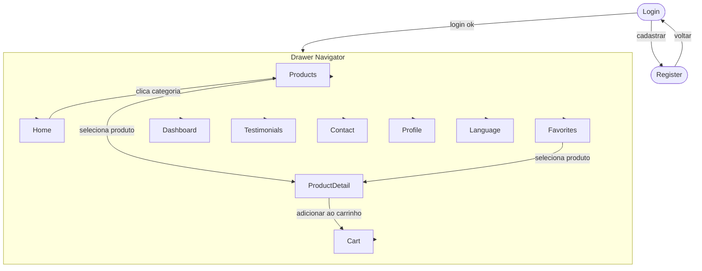
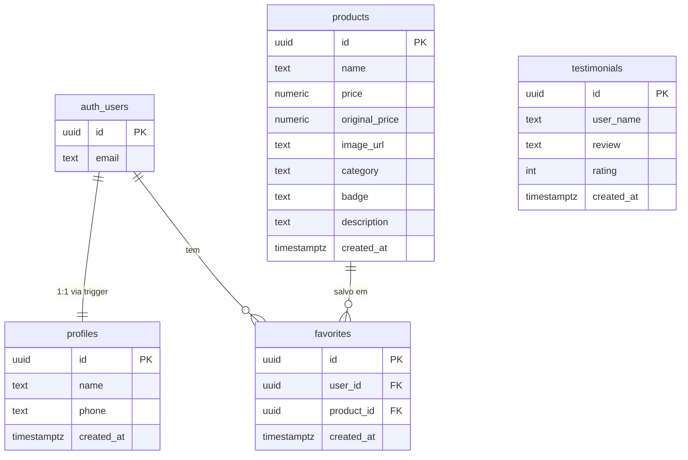
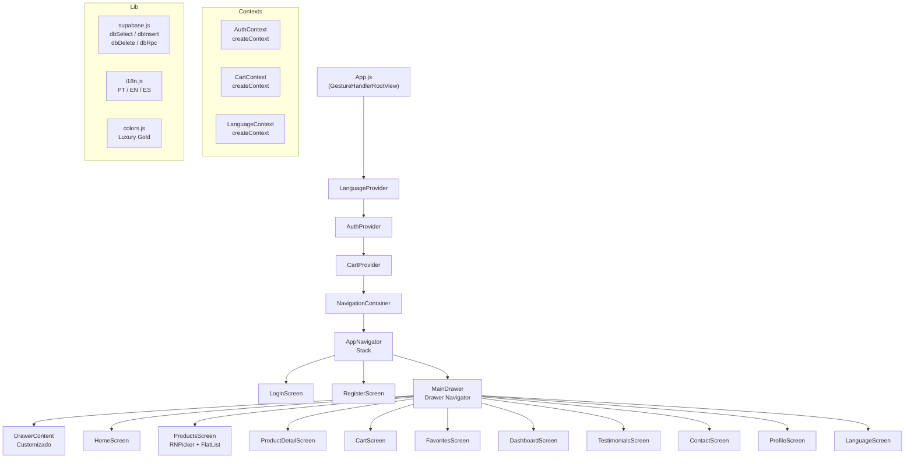

# Aurora Joias

App mobile de joalheria de luxo construído com **Expo SDK 51 + React Native 0.74**, integrado ao Supabase e com suporte a PT / EN / ES.
Projeto acadêmico — 2º Bimestre | Desenvolvimento Mobile.

---

## Tech Stack

| Camada        | Tecnologia                                                      |
| ------------- | --------------------------------------------------------------- |
| Runtime       | Expo SDK 51 + React Native 0.74                                 |
| Navegação     | React Navigation 6 — Stack + Drawer customizado                 |
| Formulários   | React Hook Form 7 (`useForm` + `Controller`)                    |
| Backend       | Supabase REST + Auth API via `fetch` (sem SDK)                  |
| Estado global | React Context — `AuthContext`, `CartContext`, `LanguageContext` |
| i18n          | PT / EN / ES via `LanguageContext` + `lib/i18n.js`              |
| Ícones        | `@expo/vector-icons` — Ionicons                                 |
| Filtros       | `@react-native-picker/picker` (RNPicker + FlatList)             |

---

## 12 Telas

| #   | Tela          | Tipo        | Funcionalidade principal                                           |
| --- | ------------- | ----------- | ------------------------------------------------------------------ |
| 1   | Login         | Obrigatória | Autenticação Supabase, erro amigável, botão de idioma              |
| 2   | Register      | Obrigatória | Cadastro com 5 campos validados (React Hook Form), botão de idioma |
| 3   | Dashboard     | Obrigatória | Total de usuários (RPC) + produtos por categoria com barras        |
| 4   | Language      | Obrigatória | Seletor PT / EN / ES via LanguageContext                           |
| 5   | Home          | Custom      | Hero, stats, categorias com navegação filtrada                     |
| 6   | Products      | Custom      | RNPicker + FlatList (filtro por categoria), pré-filtro da Home     |
| 7   | ProductDetail | Custom      | Detalhe, toggle favorito (POST/DELETE Supabase), AddToCart         |
| 8   | Cart          | Custom      | Lista com CartItem, total e checkout via CartContext               |
| 9   | Favorites     | Custom      | Wishlist carregada do Supabase com useEffect                       |
| 10  | Testimonials  | Custom      | Depoimentos do Supabase via TestimonialCard                        |
| 11  | Contact       | Custom      | Endereço, telefones e horários de funcionamento                    |
| 12  | Profile       | Custom      | Edição de dados pessoais (PATCH no Supabase)                       |

---

## Fluxo de Navegação



---

## Esquema do Banco de Dados



---

## Arquitetura do App



---

## Como Rodar

### Localmente

```bash
npm install --legacy-peer-deps
npx expo start          # QR code para Expo Go
npx expo start --web    # versão web no navegador
npx expo start --android
```

### Expo Snack

1. Acesse [snack.expo.dev](https://snack.expo.dev) → **Create a snack**
2. Faça upload de todos os arquivos (exceto `assets/` — imagens via GitHub URL)
3. Plataforma **Web** → **Run**

---

## Configuração do Supabase

1. Crie um projeto em [supabase.com](https://supabase.com)
2. Em **Authentication → Providers → Email** → desmarque **"Confirm email"**
3. Execute as migrations em ordem no **SQL Editor**:

```
supabase/migrations/001_tables.sql
supabase/migrations/002_triggers.sql
supabase/migrations/003_rls.sql
supabase/migrations/004_rpc.sql
supabase/migrations/005_seed.sql
```

4. Copie a **Project URL** e a **anon key** em **Settings → API** e cole em `lib/supabase.js`:

```js
export const SUPABASE_URL     = 'https://SEU_PROJETO.supabase.co';
export const SUPABASE_API_KEY = 'SUA_CHAVE_ANON_AQUI';
```

> Veja [`supabase/README.md`](supabase/README.md) para instruções detalhadas.

---

## Banco de Dados

| Tabela         | Acesso                        | Descrição                                           |
| -------------- | ----------------------------- | --------------------------------------------------- |
| `products`     | Leitura pública               | Catálogo — name, price, category, badge, description |
| `favorites`    | Autenticado (RLS por user_id) | Wishlist — user_id + product_id                     |
| `testimonials` | Leitura pública               | Depoimentos — user_name, rating, review             |
| `profiles`     | Autenticado (RLS por id)      | Dados do usuário — criado via trigger no signup     |

---

## Design

Tema: **Dark + Luxury Gold**

| Token        | Hex       | Uso                                        |
| ------------ | --------- | ------------------------------------------ |
| `primary`    | `#B8860B` | Botões, bordas ativas, barras do dashboard |
| `secondary`  | `#DAA520` | Títulos, ícones, links                     |
| `background` | `#0A0A0A` | Fundo de todas as telas                    |
| `surface`    | `#1C1C1C` | Headers, drawer, surface cards             |
| `card`       | `#242424` | Inputs, picker, product cards              |
| `text`       | `#F5F5DC` | Texto principal                            |
| `textMuted`  | `#A0A0A0` | Labels, placeholders                       |

---

## Componentes Reutilizáveis

| Componente        | Usado em                        |
| ----------------- | ------------------------------- |
| `ProductCard`     | ProductsScreen, FavoritesScreen |
| `CartItem`        | CartScreen                      |
| `TestimonialCard` | TestimonialsScreen              |
| `CategoryBadge`   | ProductDetailScreen             |

---

## Time

- ISLLAN TOSO PEREIRA
- STEFANO SILVESTRI
- MARCELO PASSAMAI MARQUES

_Aurora Joias — Projeto Acadêmico 2026_
